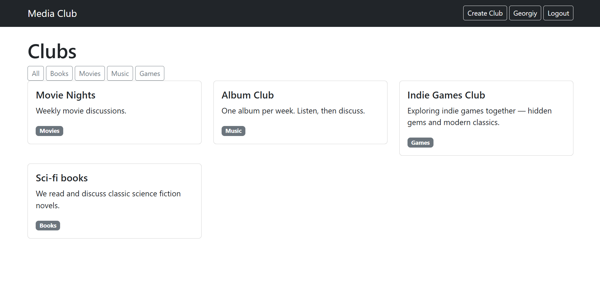
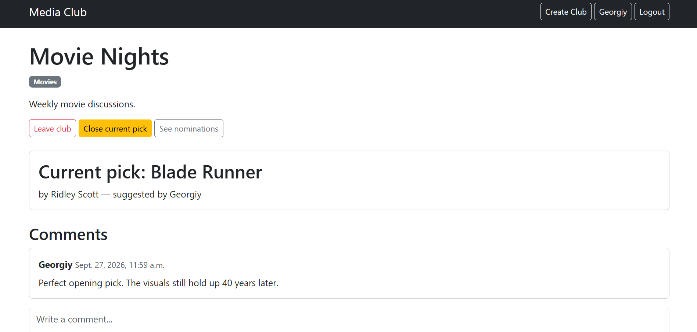
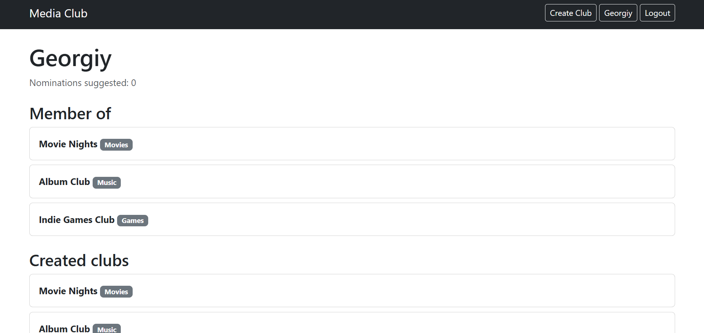
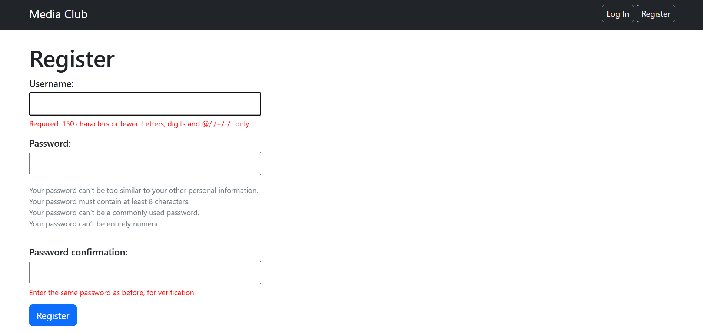

# Media Club

> A Django web application for creating and managing interest clubs around books, movies, music, and games.

[](https://www.djangoproject.com/)
[](https://www.python.org/)
[](https://getbootstrap.com/)
[](https://developer.mozilla.org/en-US/docs/Web/JavaScript)
[](#license)

---

## Overview

Media Club is a full-stack web application where users create topic-based clubs, discuss a current item (a "pick"), suggest what to discuss next, and vote for their favorite nomination. When the club owner closes the current pick, the most voted nomination automatically becomes the next active pick — a self-sustaining content discussion pipeline.

---

## Screenshots

| Home page | Club page |
|:---:|:---:|
|  |  |

| User profile | Registration |
|:---:|:---:|
|  |  |

---

## Features

- **User authentication** — registration, login, logout using Django's built-in auth system
- **Clubs** — create clubs with a name, description, and category (Books, Movies, Music, Games)
- **Current pick** — each club has exactly one active pick; the creator sets the first one at creation
- **Membership** — join and leave clubs; the creator is automatically a member
- **Comments** — members discuss the current pick
- **Nominations** — any logged-in user can suggest candidates for the next pick
- **Voting** — toggle voting via async requests; vote counts update without reloading the page
- **Close pick** — the club owner can close the current pick; the most voted nomination becomes the next one, remaining votes are reset
- **Profiles** — view any user's memberships, created clubs, and nomination count
- **Category filter** — filter clubs by category on the home page
- **Mobile-responsive** — layout adapts to phones, tablets, and desktops via Bootstrap 5

---

## Tech Stack

| Layer | Technology |
|---|---|
| **Backend** | Django 6.1 (models, views, forms, auth) |
| **Database** | SQLite |
| **Frontend** | HTML5, Bootstrap 5.3 (CDN), Vanilla JavaScript (ES6) |
| **Async** | `fetch` API with CSRF handling |
| **Language** | Python 3.13 |

---

## Project Structure

```
media_club/
├── manage.py
├── requirements.txt
├── README.md
├── db.sqlite3
├── mediaclub/              # Django project package
│   ├── settings.py
│   ├── urls.py
│   ├── wsgi.py
│   └── asgi.py
└── clubs/                  # Main application
    ├── models.py           # 6 models: Club, Membership, Pick, Comment, Nomination, Vote
    ├── views.py            # All views
    ├── urls.py             # URL routes
    ├── forms.py            # ClubCreateForm
    ├── admin.py            # Admin registrations
    ├── migrations/
    ├── static/
    │   ├── clubs/vote.js   # Async voting logic
    │   └── styles/style.css
    └── templates/
        ├── clubs/          # App templates
        └── registration/   # Login template
```

---

## Data Model

| Model | Purpose | Key Relations |
|---|---|---|
| `Club` | A topic-based club | `creator → User`, `members ↔ User` (through `Membership`) |
| `Membership` | User–club link | `user → User`, `club → Club` (unique per pair) |
| `Pick` | Current item being discussed | `club → Club`, `author → User`, `is_active` flag |
| `Comment` | Comment on a pick | `pick → Pick`, `author → User` |
| `Nomination` | Suggested next pick | `club → Club`, `author → User` |
| `Vote` | Vote for a nomination | `nomination → Nomination`, `user → User` (unique per pair) |

---

## Installation

### Prerequisites
- Python 3.10+
- pip

### Steps

1. **Clone the repository**
   ```bash
   git clone https://github.com/GeorgiyWeb/media_club.git
   cd media_club
   ```

2. **Create and activate a virtual environment**
   ```bash
   python -m venv .venv
   # Windows
   .venv\Scripts\activate
   # macOS / Linux
   source .venv/bin/activate
   ```

3. **Install dependencies**
   ```bash
   pip install -r requirements.txt
   ```

4. **Apply migrations**
   ```bash
   python manage.py migrate
   ```

5. **Create a superuser (optional, for admin access)**
   ```bash
   python manage.py createsuperuser
   ```

6. **Run the development server**
   ```bash
   python manage.py runserver
   ```

7. Open [http://127.0.0.1:8000/](http://127.0.0.1:8000/) in your browser.

---

## Usage

1. **Register** a new account at `/register/`.
2. **Create a club** at `/clubs/create/` — pick a category and set the first pick.
3. **Comment** on the current pick from the club page.
4. **Suggest nominations** on the nominations page.
5. **Vote** for your favorite — the count updates without reloading.
6. **Close the pick** (as the club creator) — the winner becomes the next active pick.
7. **Explore profiles** at `/profile/<username>/`.

---

## License

Released under the [MIT License](https://opensource.org/licenses/MIT).  
Feel free to use this project for learning purposes.